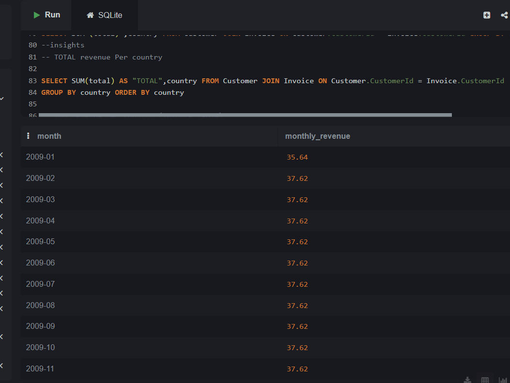
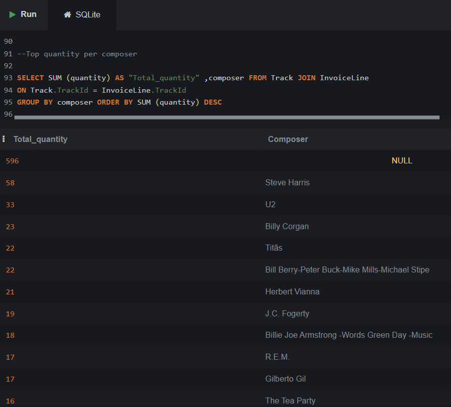
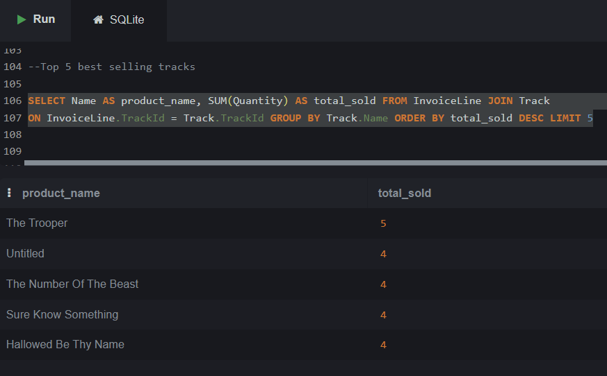

# Chinook Sales Analysis (SQL)
##  Project Overview
This project analyzes the Chinook database using SQL to extract business insights related to sales, customers, and tracks performance. 
## Tools Used
- SQL (SQLite) 
- Chinook Database 
## Key Analysis
- Data filtering and exploration
- Aggregations (SUM, AVG, MIN, MAX)
- Joins between multiple tables
- Revenue analysis by country
- Top customers by spending
- Monthly revenue trends 
- Window functions (ROW_NUMBER)
- CTE and View creation
  ## 📊 Key Insights

### Total Revenue per Country

### Top Quantity per Composer

### Top 5 Best Selling Tracks

 ##  Files
 - `Chinook.sql` → contains all analysis queries
   ## Author
   **Rana Mohamed**

